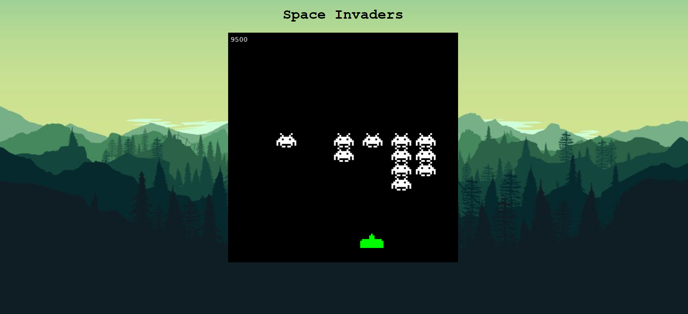
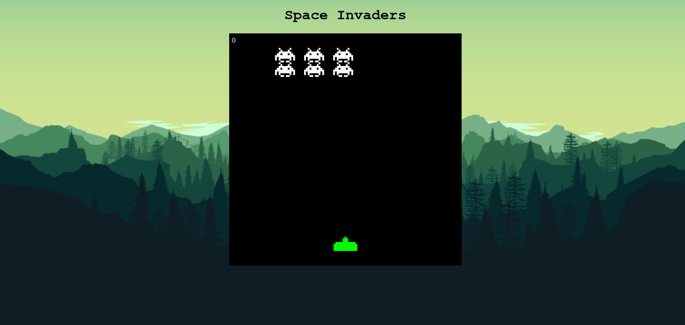

# Alien Invaders

Alien Invaders is a classic arcade game where the player controls a spaceship to defend against invading alien ships. The game is built using HTML, CSS, and JavaScript.

## How to Play

- Use the left and right arrow keys to move the spaceship.
- Use the spacebar to shoot lasers and destroy alien ships.
- Destroy all alien ships to advance to the next level.

## Demo

You can play the game [here](https://sithumsankajith.github.io/alien-invaders/).

## Screenshots

## Technologies Used

- HTML
- CSS
- JavaScript

## License

This project is licensed under the MIT License - see the [LICENSE](LICENSE) file for details.
